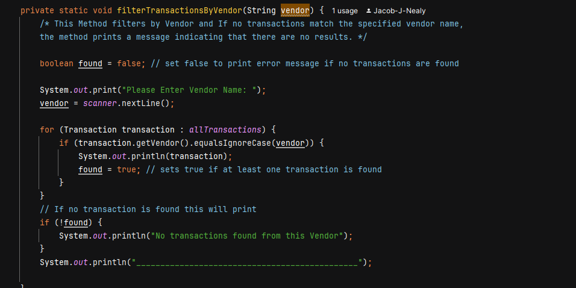
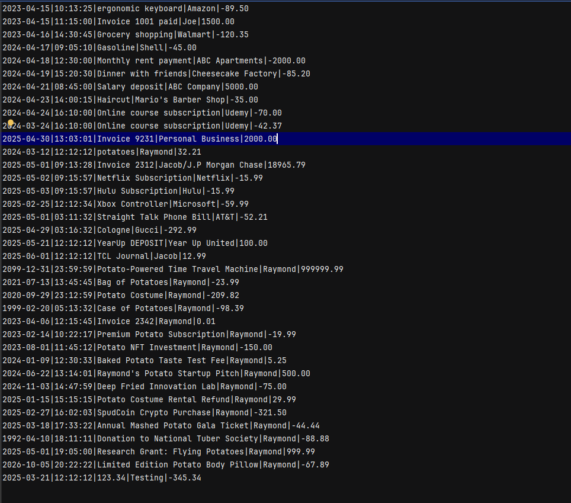
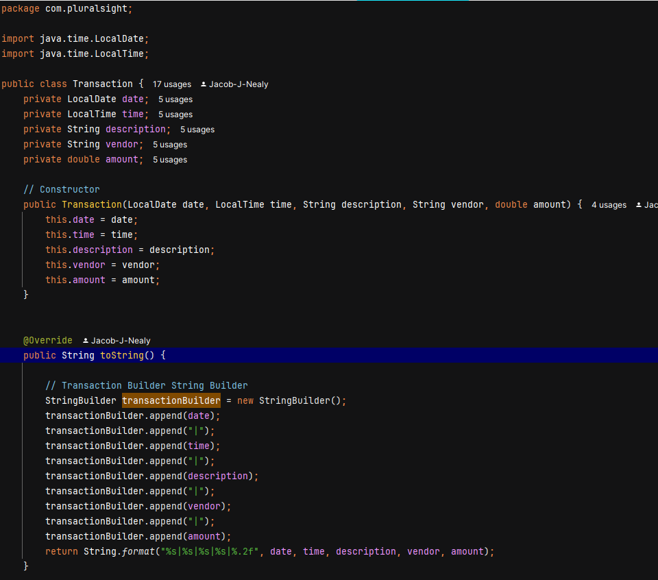

# Financial Tracker

## A CLI Application that tracks Income and Expense & allows the user the ability to custom search for specific entries. 

This application tracks user-entered deposits and allows users to make payments with their debit information
It also includes a custom search feature for finding specific entries based on Month, Year, or Vendor. 
I'm also planning to expand the search functionality by adding filters for description, vendor, amount spent, and purchase date.
But...let's see if we get to that!

## User Stories
Throughout the development of this application, these User Stories played a role in shaping my process and decisions. 
They served as a roadmap, helping me stay focused on creating features that would truly meet user needs. 
Each story has details for how I wanted to build an application intuitive, functional, and user-friendly experience. 
I'm excited to share how these User Stories guided the evolution of the application and brought the vision to life!

- Home Screen: As a user, I would like a clean and simple home screen where I can easily Add Deposits, Make Payments, View the Ledger, 
and Exit the Application; so that I can quickly access the specific part of the tool I need without confusion, save time navigating, 
and manage my finances more efficiently.

- Exit: As a User I would a simple exit button on the home screen to close out the application when I am done with it.

- Add Deposits Button: As a user, I would like the Add Deposits option to prompt me for relevant information—such as date, amount, 
description, and vendor—and automatically store this data in a structured CSV file; so that I can maintain an organized digital record, 
easily retrieve and review my financial entries later, and ensure comprehensive tracking of all deposit activity over time.

- Make Payment Option: As a User I would like the Make Payments option to be simple and easy to use so that I can input information
with little user mistake and save it for later use so, I can have better ease of use long term.

- Ledger: As a User I would like a Ledger Option that displays all my newest entries first with the option to Display All Entries; 
Display Deposits Only; Display Payments Only; and Display Reports which allows me to run a custom search by specific attributes.

- Login: As a User I would like a simple login screen that ask me for my username and password to differentiate my transactions 
from another username so that I can be the only one to view my transactions

## Setup (Generated)
Instructions on how to set up and run the project using IntelliJ IDEA.

1. Open IntelliJ IDEA
   Launch IntelliJ.

On the welcome screen, click "New Project" or "Open" if you already have the folder.

2. Create or Open a Java Project
   If creating new:

Choose "Java".

Make sure SDK is selected (download one if not).

Click Next > Finish.

If opening an existing project:

Go to File > Open and select your project folder.

3. Add a New Java Class (if needed)
   Right-click src > New > Java Class

Name it Main (or your preferred name).

4. Write or Paste Your Code
   Paste your public static void main(String[] args) method in the class.

5. Run the Program
   Click the green ▶ Run button near your main() method, or

Right-click the file > Run 'Main.main()'

### Prerequisites
- IntelliJ IDEA: Ensure you have IntelliJ IDEA installed, which you can download from [here](https://www.jetbrains.com/idea/download/).
- Java SDK: Make sure Java SDK is installed and configured in IntelliJ.

### Running the Application in IntelliJ

Follow these steps to get your application running within IntelliJ IDEA:

1. Open IntelliJ IDEA.
2. Select "Open" and navigate to the directory where you cloned or downloaded the project.
3. After the project opens, wait for IntelliJ to index the files and set up the project.
4. Find the main class with the `public static void main(String[] args)` method.
5. Right-click on the file and select 'Run 'YourMainClassName.main()'' to start the application.

## Technologies Used

- Java 17 Maven.

## Demo

## Future Work

Outline potential future enhancements or functionalities you might consider adding:

- Custom Transaction Search
- Improvement of current functionalities.
- Try/Catches for all User input errors
- User Login to Display only certain information from csv

- [ChatGPT](https://chatgpt.com/)
- [Effective Java](https://www.example.com)

## Team Members

- **Jacob Nealy** - Main Creator

## Thanks

Shout Out to my Potato Instructor Raymond Mourn for his french fry guidance
Shout out to Walter Donnellan (My Tutor) for sacrificing his lunch breaks and extra time to tutor me
Shoutout Adam Jessie the Debug King for explaining complex topics we didn't learn yet in class

- A special thanks to all classmates for their dedication and teamwork.
- #FullStackFryers
- #SigmaData
 